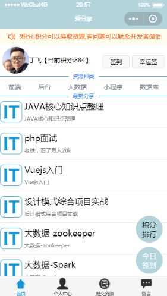
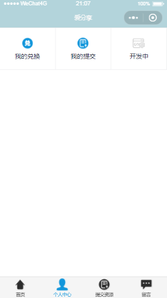
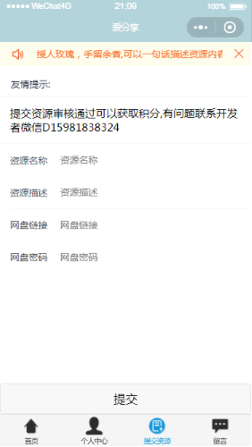
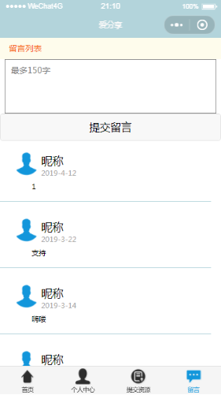

# 程序员爱分享

该小程序功能比较简单，微信用户每天签到送积分，积分可以兑换视频资源

### 前端

微信小程序前端框架使用ivew weapp

### 后端

后端框架使用JFinal(国产框架)

### 数据库

数据库使用Mysql

## 小程序运行效果

@

# 注意事项

1. 设置自己的AppID和AppSecret

2. Mysql数据库执行wx.sql,生成小程序相关的表

   ###联系方式

   有任何问题可以加微信D15981838324,下面是该小程序二维码,扫码体验

